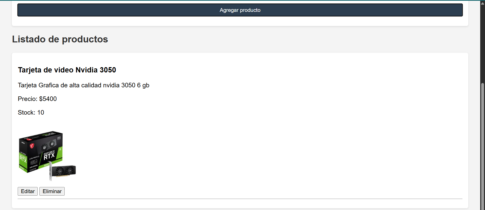
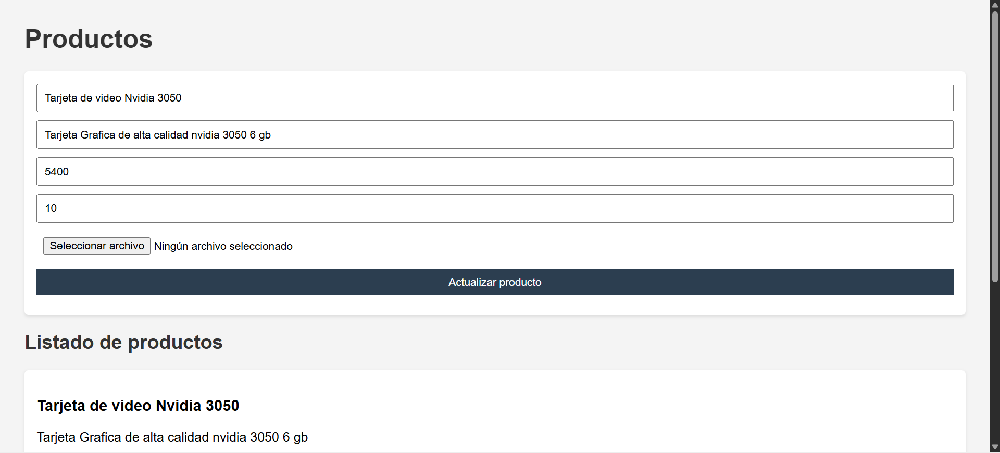
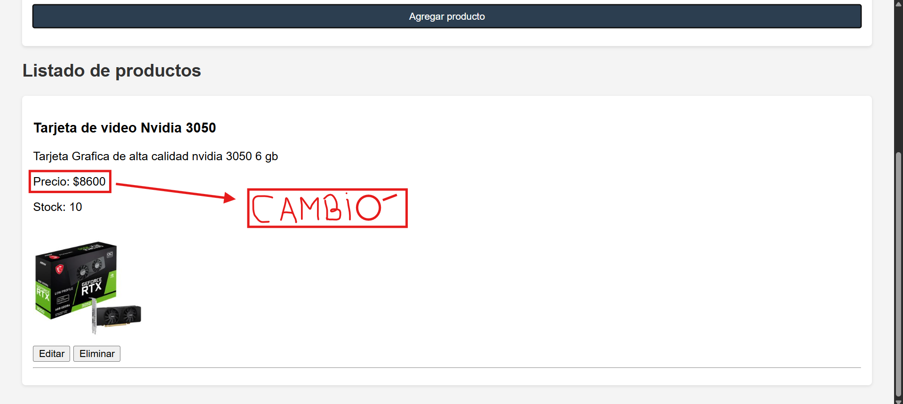

# 💼 Sistema de Gestión de Productos

Este proyecto es un sistema de backend desarrollado en Node.js y Express para la gestión de productos. Permite crear, leer, actualizar y eliminar productos, así como manejar imágenes mediante Multer.

---

## 🚀 Tecnologías Utilizadas

- ✅ Node.js
- ✅ Express
- ✅ MongoDB + Mongoose
- ✅ Multer (carga de imágenes)
- ✅ HTML + CSS (interfaz simple)
- ✅ Git + GitHub

---

## 🛠 Cómo Ejecutar el Proyecto

1. Clonar el repositorio:
```bash
git clone https://github.com/Rodrivazq/Programacion-Backend-1.git
```

2. Instalar dependencias:
```bash
npm install
```

3. Crear archivo `.env` con la conexión a MongoDB (si se requiere).

4. Ejecutar el servidor:
```bash
node server.js
```

---

## 🌐 Endpoints Principales

| Método | Ruta              | Descripción               |
|--------|-------------------|---------------------------|
| GET    | `/productos`      | Obtener todos los productos |
| POST   | `/productos`      | Crear un nuevo producto   |
| PUT    | `/productos/:id`  | Actualizar un producto    |
| DELETE | `/productos/:id`  | Eliminar un producto      |

---

## 📂 Estructura de Carpetas

```
├── middleware/
├── models/
├── public/
├── routes/
├── uploads/
├── server.js
├── package.json
├── README.md
```

---

## ✅ Estado del Proyecto

✅ Finalizado y funcional para entrega

---

## 📸 Capturas de Pantalla

### 📥 Formulario de carga


### 📄 Listado de productos


### 🛠 Producto modificado


---

## 👤 Autor

Rodrigo Vázquez  
[GitHub](https://github.com/Rodrivazq)
